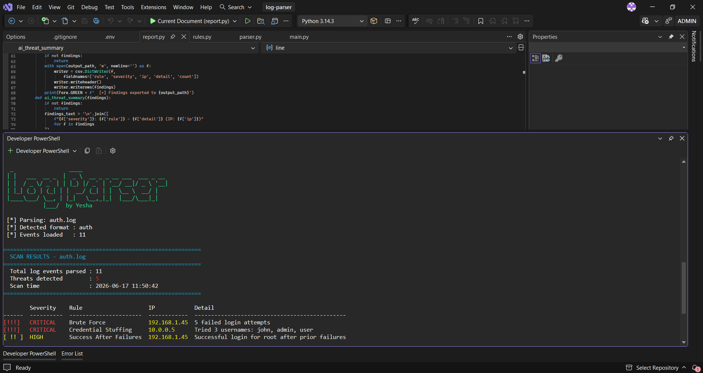
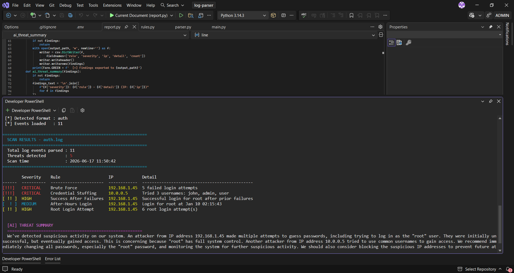

# Log Parser

A command-line tool I built that reads through SSH authentication logs and Apache access logs, flags suspicious activity based on a set of detection rules, and can optionally summarize what it found in plain English using an LLM.

## Why I built this

I built  a tool that ingests a raw log file and surfaces the patterns an analyst would actually be looking for — brute force attempts, credential stuffing, a successful login right after a string of failures, logins at 3am, someone trying to log in as root. It's pure Python with no lab environment required, which made it something I could actually finish and iterate on instead of getting stuck on infrastructure.

## What it does

You point it at a log file, and it does three things: figures out whether it's looking at a Linux auth log or an Apache access log, parses every relevant line into a structured event, then runs that list of events through a set of detection rules and reports anything that trips a threshold.

**For auth logs**, it checks for:
- **Brute force** — 5 or more failed login attempts from the same IP
- **Credential stuffing** — the same IP trying 3 or more different usernames
- **Success after failure** — a login that succeeds from an IP that had prior failed attempts (this one's the scariest pattern in here, honestly — it usually means the attack worked)
- **After-hours login** — a successful login between midnight and 6am
- **Root login attempts** — any login attempt for the root account, successful or not

**For Apache logs**, it checks for:
- **Path traversal** — requests containing `../` in the path
- **Admin brute force** — 3 or more 401 (unauthorized) responses from the same IP

Findings get printed as a color-coded table (red for critical, yellow for high, cyan for medium) and can be exported to CSV. There's also an `--ai` flag that takes the findings and asks an LLM to translate them into a short, non-technical summary — something you could realistically hand to a manager who doesn't know what a 401 status code is.

## How it's structured

Four files, no subfolders, no over-engineering:

- `parser.py` — regex-based parsing. Has separate functions for auth logs and Apache logs, plus an `auto_parse` function that peeks at the first 500 characters of a file and decides which parser to hand it to.
- `rules.py` — the actual detection logic. Each rule is its own function that takes the parsed events and returns a list of findings if anything crosses its threshold.
- `report.py` — handles all the output: the terminal banner, the color-coded findings table, CSV export, and the AI summary call.
- `main.py` — the CLI entry point. Wires everything together with `argparse`.

## Setup

Clone the repo, then install dependencies:

```bash
pip install -r requirements.txt
```

If you want the AI summary feature, you'll need a [Groq](https://console.groq.com) API key (it's free to sign up). Create a `.env` file in the project root:

```
GROQ_API_KEY=your_key_here
```

This repo's `.gitignore` already excludes `.env`, so your key never ends up in version control. If you're cloning this and want to know what variable to set, check `.env.example`.

## Usage

Run it against a log file:

```bash
python main.py --file sample/auth.log
```

Export findings to CSV:

```bash
python main.py --file sample/auth.log --export
```

Get the AI-generated plain-English summary:

```bash
python main.py --file sample/auth.log --ai
```

All three flags can be combined.

## Sample output

```
  _                 ____
 | |   ___  __ _  |  _ \  __ _ _ __ ___  ___ _ __
 | |  / _ \/ _` | | |_) |/ _` | '__/ __|/ _ \ '__|
 | |_| (_) | (_| | |  __/ (_| | |  \__ \  __/ |
 |____\___/ \__, | |_|   \__,_|_|  |___/\___|_|
            |___/  by Yesha

 [*] Parsing: sample/auth.log
 [*] Detected format : auth
 [*] Events loaded   : 10

============================================================
  SCAN RESULTS - auth.log
============================================================
  Total log events parsed : 10
  Threats detected        : 6
============================================================

  [!!!]  CRITICAL    Brute Force          192.168.1.50   5 failed login attempts
  [!!!]  CRITICAL    Credential Stuffing  10.0.0.7       Tried 3 usernames: admin, jdoe, guest
  [ !! ]  HIGH        Success After Failures  192.168.1.50   Successful login for root after prior failures
  [ !! ]  HIGH        Root Login Attempt   192.168.1.50   1 root login attempt(s)
  [  ! ]  MEDIUM      After-Hours Login    192.168.1.50   Login for root at Jun 14 02:15:43

  [AI] THREAT SUMMARY
  ========================================================
  There were several significant security incidents. An attacker
  from 192.168.1.50 tried to guess the password with 5 failed
  attempts, then successfully logged in as root — this is
  concerning because root has full system access. A separate
  attacker from 10.0.0.7 tried multiple common usernames, which
  suggests they were probing for any valid account rather than
  targeting one person.

  Recommended actions: rotate the root password immediately,
  block both IPs, and review login policies to prevent repeat
  attempts.
```

## Sample Output

Running against the sample auth log, with the `--ai` flag enabled:




## What I'd add next

A `--watch` flag for live log monitoring instead of one-shot file reads, support for a couple more log formats (Windows Event Logs would be the obvious next one given how much SOC work touches Windows environments), and eventually feeding flagged events into a small dashboard instead of just terminal output. The AI summary piece was originally meant to be a stretch goal, but it ended up being the part that makes this feel less like a script and more like an actual analyst-assist tool.

## What I learned

The detection logic itself was the easy part — once you know what a brute force attempt looks like in a log line, writing a regex for it isn't hard. The harder, more useful lesson was around handling secrets correctly: structuring the API key through environment variables and a `.gitignore`'d `.env` file instead of hardcoding it, which is a small thing but exactly the kind of habit that matters once code leaves your own machine. Debugging the API integration also forced me to actually read API responses instead of assuming they'd come back in the shape I expected, which is a more realistic version of troubleshooting than most tutorial-following ever is.

## Tech stack

Python 3, `colorama`, `tabulate`, `requests`, `python-dotenv`, and the Groq API (`llama-3.3-70b-versatile`) for the AI summary feature.
